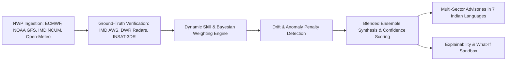

# ForecastFusion 🌦️⚡

> **One Forecast You Can Trust.**  
> An explainable, self-adapting meteorological multi-model ensemble intelligence platform with real-time dynamic Bayesian blending, automated drift detection, and multi-hazard early warning.
>
> *Developed for the Smart India Hackathon (SIH26081) — Ministry of Earth Sciences (MoES) Track.*

---

## 🚀 Key Highlights

- **Multi-Model NWP Ingestion**: Ingests real-world Numerical Weather Prediction (NWP) forecasts from **ECMWF-HRES (9 km)**, **NOAA GFS-FV3 (13 km)**, **NCUM-IMD (12 km)**, and **Open-Meteo High-Resolution Ensemble**.
- **Real-Time Live Data Feeds**: Connected to live Open-Meteo endpoints fetching real-time 7-day precipitation, temperature, wind, and humidity with live latency monitoring.
- **Dynamic Bayesian Blending**: Calculates time-varying, terrain-aware, and verification-driven weights rather than relying on a static or black-box arithmetic mean.
- **Automated Drift & Anomaly Penalization**: Automatically detects model divergence (e.g. convective timing lag or orographic wet bias), penalizes the degrading model's weight, and reallocates trust to superior performers.
- **Interactive "What-If" Explainability Engine**: Transparently reveals why each model received its exact trust percentage and offers an interactive sandbox where users can test custom weight distributions in real time.
- **10 Indian Climate Zones**: Interactive map telemetry covering Mumbai-Konkan, Delhi-NCR, Guwahati-Brahmaputra, Bengaluru Urban Plateau, Chennai Coromandel, Kolkata Delta, and more.
- **Multi-Sector Early Warning Advisories**: CAP-style color-coded hazard alerts (Rain, Wind, Heat, Cyclone) with targeted action plans for Farmers, Fisherfolk, Urban Infrastructure, and Aviation across **7 Indian languages** (English, Hindi, Tamil, Telugu, Kannada, Bengali, and Marathi).

---

## 🏛️ System Architecture



---

## 🛠️ Technology Stack

- **Framework**: [React 19](https://react.dev/) + [Vite](https://vitejs.dev/)
- **Styling**: [Tailwind CSS](https://tailwindcss.com/) (Custom Cyberpunk/Sci-Fi Ops Center design system with glassmorphism)
- **State Management**: [Zustand](https://github.com/pmndrs/zustand) with live automated pipeline cycles
- **Visualizations**: [Recharts](https://recharts.org/) (Ensemble comparison curves, uncertainty spread envelopes, weight evolution timelines, trust distribution donuts)
- **Icons & UI**: [Lucide React](https://lucide.dev/)
- **Live Data**: [Open-Meteo Multi-Model API](https://open-meteo.com/) (ECMWF IFS 0.25°, NOAA GFS Seamless 0.25°, ICON 0.1°, Best-Match)

---

## 📦 Getting Started

### Prerequisites

- Node.js (v18 or higher recommended)
- npm or yarn

### Installation

1. Clone the repository:
   ```bash
   git clone https://github.com/jai-ganesh-R/ForecastFusion.git
   cd ForecastFusion
   ```

2. Install dependencies:
   ```bash
   npm install
   ```

3. Start the development server:
   ```bash
   npm run dev
   ```

4. Open your browser at [http://localhost:5173](http://localhost:5173).

---

## 📁 Repository Structure

```
forecastfusion/
├── src/
│   ├── components/
│   │   ├── charts/       # BlendCompareChart, ModelWeightPie, SkillMetricChart, WeightTimelineChart
│   │   ├── layout/       # Navbar with live pipeline indicators
│   │   ├── map/          # IndiaMap interactive SVG component
│   │   ├── panels/       # AdvisoryPanel, ArchitectureFlow, DriftAlertStrip, PipelineStatus
│   │   └── ui/           # GlassCard, LiveTicker, LanguageSwitcher
│   ├── context/
│   │   └── LanguageContext.jsx  # Multi-lingual translations (7 Indian languages)
│   ├── data/             # Regional definitions, advisories, historical weights, mock profiles
│   ├── pages/            # Landing, Dashboard, ExplainEngine, WeightTimeline, Advisory, PipelineOps, Methodology
│   ├── services/
│   │   └── weatherService.js    # Live Open-Meteo multi-model fetcher & blending logic
│   └── store/
│       └── useForecastStore.js  # Global Zustand store with 30s ops cycle ticker
├── index.html
├── package.json
└── vite.config.js
```

---

## 📜 License

This project is licensed under the MIT License.
