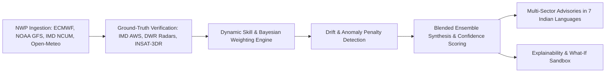

# ForecastFusion 🌦️⚡

> **One Forecast You Can Trust.**  
> An explainable, self-adapting meteorological multi-model ensemble intelligence platform with real-time dynamic Bayesian blending, automated drift detection, and multi-hazard early warning.
>
> *Developed for the Smart India Hackathon (SIH26081) — Ministry of Earth Sciences (MoES) Track.*

---

## 🚀 Key Highlights

- **Multi-Model NWP Ingestion**: Ingests real-world Numerical Weather Prediction (NWP) forecasts from **ECMWF-HRES (9 km)**, **NOAA GFS-FV3 (13 km)**, **NCUM-IMD (12 km)**, and **Open-Meteo High-Resolution Ensemble**.
- **Real-Time Live Data Feeds**: Connected to live Open-Meteo endpoints fetching real-time 7-day precipitation, temperature, wind, and humidity with live latency monitoring.
- **Dynamic Bayesian Blending**: Calculates time-varying, terrain-aware, and verification-driven weights rather than relying on a static or black-box arithmetic mean.
- **Automated Drift & Anomaly Penalization**: Automatically detects model divergence (e.g. convective timing lag or orographic wet bias), penalizes the degrading model's weight, and reallocates trust to superior performers.
- **Interactive "What-If" Explainability Engine**: Transparently reveals why each model received its exact trust percentage and offers an interactive sandbox where users can test custom weight distributions in real time.
- **10 Indian Climate Zones**: Interactive map telemetry covering Mumbai-Konkan, Delhi-NCR, Guwahati-Brahmaputra, Bengaluru Urban Plateau, Chennai Coromandel, Kolkata Delta, and more.
- **Multi-Sector Early Warning Advisories**: CAP-style color-coded hazard alerts (Rain, Wind, Heat, Cyclone) with targeted action plans for Farmers, Fisherfolk, Urban Infrastructure, and Aviation across **7 Indian languages** (English, Hindi, Tamil, Telugu, Kannada, Bengali, and Marathi).

---

## 🏛️ System Architecture


```mermaid
flowchart LR
    A[NWP Ingestion: ECMWF, NOAA GFS, IMD NCUM, Open-Meteo] --> B[Ground-Truth Verification: IMD AWS, DWR Radars, INSAT-3DR]
    B --> C[Dynamic Skill & Bayesian Weighting Engine]
    C --> D[Drift & Anomaly Penalty Detection]
    D --> E[Blended Ensemble Synthesis & Confidence Scoring]
    E --> F[Multi-Sector Advisories in 7 Indian Languages]
    E --> G[Explainability & What-If Sandbox]
```

---

## 🛠️ Technology Stack

### Frontend
- **Framework**: [React 19](https://react.dev/) + [Vite](https://vitejs.dev/)
- **Styling**: [Tailwind CSS](https://tailwindcss.com/) (Custom Cyberpunk/Sci-Fi Ops Center design system with glassmorphism)
- **State Management**: [Zustand](https://github.com/pmndrs/zustand) with live automated pipeline cycles & WebSocket telemetry
- **Visualizations**: [Recharts](https://recharts.org/) (Ensemble comparison curves, uncertainty spread envelopes, weight evolution timelines, trust distribution donuts)
- **Icons & UI**: [Lucide React](https://lucide.dev/)
- **Live Data**: [Open-Meteo Multi-Model API](https://open-meteo.com/) (ECMWF IFS 0.25°, NOAA GFS Seamless 0.25°, ICON 0.1°, Best-Match)

### Backend (Production-Grade FastAPI)
- **Framework**: [FastAPI](https://fastapi.tiangolo.com/) with asynchronous ASGI architecture
- **Mathematical Blending**: [NumPy](https://numpy.org/) & [SciPy](https://scipy.org/) (Vectorized temperature-scaled Softmax & Bayesian Model Averaging)
- **Data Ingestion**: [httpx](https://www.python-httpx.org/) async client with in-memory caching and real-time latency probes
- **Database & ORM**: [SQLAlchemy 2.0](https://www.sqlalchemy.org/) async with SQLite (local development) and TimescaleDB / PostGIS configuration (production Docker Compose)
- **Alert Standard**: OASIS Common Alerting Protocol ([CAP-v1.2](https://docs.oasis-open.org/emergency/cap/v1.2/CAP-v1.2.html)) XML generator for NDMA / MoES early warning systems
- **Real-Time Streaming**: High-throughput WebSockets (`/ws/v1/telemetry`) streaming authoritative pipeline ticks and microservice latencies

---

## 📦 Getting Started

### 1. Launch the Backend API (FastAPI)

```bash
# Windows quick start (starts Uvicorn on http://localhost:8000)
.\start_backend.bat

# Or manually using the Python virtual environment:
backend\.venv\Scripts\python.exe backend\run.py
```
- **Interactive Swagger Documentation**: [http://localhost:8000/docs](http://localhost:8000/docs)
- **Health Check**: [http://localhost:8000/health](http://localhost:8000/health)

### 2. Launch the Frontend UI (React + Vite)

```bash
npm install
npm run dev
```
- Open [http://localhost:5173](http://localhost:5173) in your browser. The top navbar badge will display `FASTAPI LIVE` with cyan pulsating telemetry. If the backend is ever stopped, the frontend automatically falls back to client-side synthesis seamlessly.

---

## 🌐 Backend API Endpoints

| Method | Endpoint | Description |
|---|---|---|
| `GET` | `/health` | Service health status and environment metadata |
| `GET` | `/docs` | Interactive Swagger API documentation |
| `GET` | `/api/v1/forecasts/{region_id}` | 7-day multi-model forecast with dynamic Bayesian blended ensemble |
| `GET` | `/api/v1/weights/{region_id}` | Active Bayesian weights, 30-day timeline history, SHAP attributions, drift alerts |
| `POST` | `/api/v1/weights/what-if` | On-the-fly dynamic Bayesian recalculation with custom what-if weight distributions |
| `GET` | `/api/v1/advisories/{region_id}` | Multi-lingual early warning advisories in 7 Indian languages |
| `GET` | `/api/v1/advisories/{region_id}/cap.xml` | OASIS CAP-1.2 compliant emergency XML alert bulletin |
| `GET` | `/api/v1/pipeline/status` | Operational pipeline status, cycle count, and anomaly telemetry |
| `GET/POST`| `/api/v1/pipeline/ping` | Real-time network latency probes to NWP microservices |
| `WS` | `/ws/v1/telemetry` | Authoritative WebSocket stream broadcasting 1-second pipeline ticks |

---

## 📁 Repository Structure

```
ForecastFusion/
├── backend/
│   ├── app/
│   │   ├── api/v1/
│   │   │   ├── endpoints/    # forecasts, weights, advisories, pipeline, websockets
│   │   │   └── router.py     # Aggregated v1 APIRouter
│   │   ├── core/             # Configuration & Pydantic settings
│   │   ├── db/               # Async SQLAlchemy session & Base
│   │   ├── models/           # RegionModel (10 climate zones) & DriftEventModel
│   │   ├── schemas/          # Pydantic v2 validation models
│   │   └── services/
│   │       ├── alerts/       # OASIS CAP-1.2 XML alert generator
│   │       ├── blending/     # NumPy/SciPy Bayesian Softmax & BMA engine
│   │       └── ingestion/    # Async Open-Meteo multi-model client
│   ├── .venv/                # Local Python 3.14 virtual environment
│   ├── docker-compose.yml    # TimescaleDB + PostGIS & Redis config
│   ├── Dockerfile            # Container build for cloud deployment
│   ├── requirements.txt      # FastAPI, NumPy, SciPy, httpx, SQLAlchemy
│   ├── run.py                # Local server runner
│   └── test_all_endpoints.py # Automated suite verifying all 13 functions/endpoints
├── src/
│   ├── components/           # Charts, map, panels, UI widgets
│   ├── context/              # Multi-lingual context (7 languages)
│   ├── data/                 # Regional climate zone configurations & baselines
│   ├── pages/                # Ops center routes (Dashboard, Explain, Timeline, Advisory, Pipeline, Methodology)
│   ├── services/             # weatherService.js (FastAPI client with zero-downtime fallback)
│   └── store/                # Zustand global store with WebSocket live telemetry
├── start_backend.bat         # Single-click Windows backend runner
├── index.html
├── package.json
└── vite.config.js
```

---

## 📜 License

This project is licensed under the MIT License.

